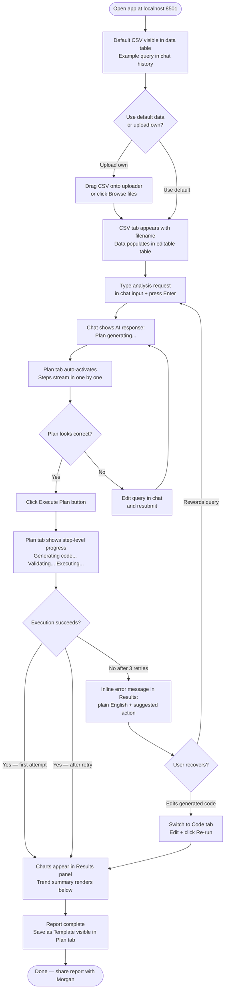
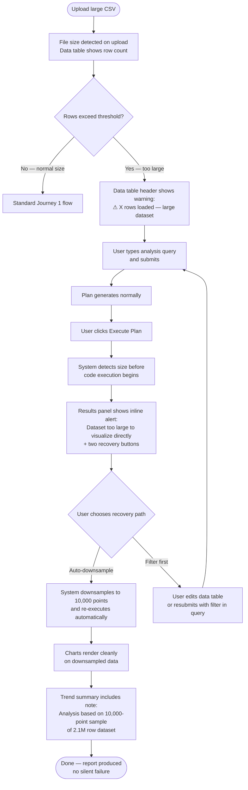
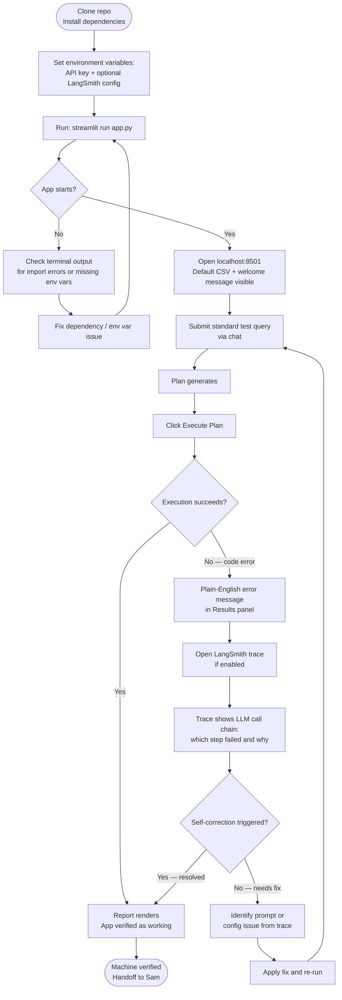

# UX Design Specification data-analysis-copilot

**Author:** Yan
**Date:** 2026-03-08

---

<!-- UX design content will be appended sequentially through collaborative workflow steps -->

## Executive Summary

### Project Vision

The Data Analysis Copilot replaces the formula-writing and chart-building burden of Excel-based workflows with a conversational interface backed by an autonomous AI execution pipeline. Engineers describe what they want in plain English; the system generates a plan, writes Python, executes it safely in an isolated subprocess (with self-correction on failure), and renders a visual report — all without the user touching code.

The UI is a four-panel Streamlit desktop application: chat interface (top-left), Plan/Code/Template tabs (top-right), editable CSV data table with upload (bottom-left), and analysis results/report panel (bottom-right).

### Target Users

**Primary: CSV-proficient engineers** — comfortable with data files and spreadsheets, not programmers. The validated archetype is Sam, an Electronics Test & Failure Analysis Engineer who needs to turn test CSVs into analysis reports fast. The broader target is any domain engineer in a similar situation: structured tabular data → insight report, without coding.

**Secondary: Engineering directors/managers (Morgan)** — indirect consumers of reports produced by primary users. Must be able to read and act on outputs without technical context.

**Developer/Maintainer (Alex)** — sets up the app on new machines, uses LangSmith tracing to debug agent failures.

### Key Design Challenges

1. **Information density in a 4-panel layout** — Four active panels on one screen must remain scannable and non-overwhelming. Each quadrant has a distinct job; visual hierarchy and spatial separation must make the workflow sequence obvious at a glance.

2. **Making the Plan → Execute two-step feel natural** — The review-then-trigger execution paradigm is a deliberate design choice (transparency + trust), but it risks feeling like an extra step. The UX must make reviewing the plan feel fast and rewarding, not bureaucratic.

3. **Execution state communication** — When the LangGraph pipeline is running (potentially for several minutes), the UI must communicate progress, not just "spinning." Users need to feel the system is working, not frozen.

4. **CSV upload + multi-file data management** — Users may upload multiple CSVs in one session. The editable table must clearly reflect what's loaded and allow confident data review before running analysis.

5. **Error and large-data states** — Graceful degradation messages must appear in the right panel at the right time, be readable by a non-technical user, and offer a clear next action — without exposing raw tracebacks.

### Design Opportunities

1. **Template system as a power feature** — "Save as template" lets engineers reuse analysis patterns across test runs. This is a high-value, low-friction feature that rewards repeat users.

2. **The Plan tab as a trust-builder** — Showing a readable step-by-step plan before execution isn't just transparency — it's the moment users gain confidence in the system. Design the plan display to be skimmable and action-oriented.

3. **Code tab as a power-user escape hatch** — Engineers who want to inspect or tweak the generated Python have a dedicated Code tab. This layer of transparency differentiates the tool from black-box AI tools and builds trust with technical users.

4. **Default CSV for zero-friction onboarding** — A pre-loaded sample dataset means a new user can run their first analysis in under a minute, before uploading their own data.

## Core User Experience

### Defining Experience

The core loop is: **describe → review → execute → read.** A user types what they want to understand about their data, reviews the generated plan with one scan, clicks Execute, and receives a report. This four-step sequence is the heartbeat of the product and must feel like a natural conversation with a capable colleague — not a software workflow.

The single most critical interaction to get right is the **chat → plan moment**: when a user submits a natural language query and the system responds with a readable, trustworthy execution plan. This is where the user decides whether to trust the system. If the plan looks right, they'll click Execute confidently. If it looks garbled or opaque, they'll hesitate or abandon.

### Platform Strategy

- **Platform:** Streamlit web app, browser-based, locally hosted (localhost)
- **Input model:** Keyboard-primary (mouse for uploads and button clicks); no touch requirement
- **Screen target:** Desktop/laptop, minimum 1280px width — the 4-panel layout requires horizontal space
- **Offline:** Not applicable — LLM API calls require network; local execution only
- **No mobile breakpoints** for MVP — engineers use workstations and laptops in lab/office environments
- **Session-scoped state:** All data (CSVs, chat history, generated code, report output) lives in Streamlit session state; no persistence across refreshes

### Effortless Interactions

These must require zero cognitive load:

1. **CSV upload** — drag-and-drop or Browse; immediate visual confirmation the data loaded correctly in the table
2. **Sending a query** — type and press Enter (or click Send); no form to fill, no parameters to set
3. **Switching between Plan / Code / Template tabs** — one click; state preserved; no re-generation
4. **Reading the plan** — numbered steps, plain English, no jargon; skimmable in under 10 seconds
5. **Default data pre-loaded** — first-time users see a working example immediately, no upload required to try the tool

### Critical Success Moments

1. **First report rendered** — the first time a chart appears in the results panel after clicking Execute. This is the "aha" moment. The layout, the chart quality, and the written summary must all deliver simultaneously.
2. **Plan inspires confidence** — after the user submits a query, the plan appears and reads exactly like what they intended. No confusion about what will happen. They click Execute without hesitation.
3. **Self-correction is invisible** — when the first code attempt fails internally and the system retries, the user sees nothing unusual — just a slightly longer wait and then a successful report. The failure is absorbed silently.
4. **Large data is handled gracefully** — when an oversized CSV is uploaded, the system surfaces a human-readable message with a clear recovery action before any silent failure can occur.
5. **Template saves analysis work** — an engineer who runs the same analysis weekly saves it as a template and re-runs it in seconds next time. This moment of repeated value is when the tool becomes indispensable.

### Experience Principles

1. **The plan is the product** — The execution plan is not a technical artifact; it's the user's contract with the system. Every design decision about plan display should make it more readable, more trustworthy, and easier to act on.
2. **The chat drives everything** — All analysis is initiated from the chat interface. The other three panels are outputs or tools. No panel should compete with or distract from the chat input as the primary action point.
3. **Transparency without friction** — Code is always available to inspect and edit (Code tab), but engineers who don't want to see it never have to. Transparency is opt-in, not forced.
4. **No dead ends** — Every failure state — large data, execution error, LLM timeout — must surface a readable message and at least one next action. Users should never be stranded.
5. **Speed builds trust** — A plan generated in under 30 seconds and a report delivered in under 15 minutes are trust signals as much as performance requirements. The UI must reinforce perceived speed (progress indicators, streaming text).

## Desired Emotional Response

### Primary Emotional Goals

**Primary: Competent and capable** — Sam should feel like a skilled analyst, not a tool operator. The product should amplify her domain expertise, not make her feel like she's learning software. When she gets a report in 15 minutes, she should feel *good at her job*, not just grateful the tool worked.

**Secondary: Trusted colleague** — the AI should feel like a knowledgeable assistant that understands what she means, not a system she has to carefully prompt or babysit.

**On completion:** Relief and confidence — the report is done, it's correct, she can share it without second-guessing it.

### Emotional Journey Mapping

| Moment | Desired Feeling | Risk to Avoid |
|---|---|---|
| First open / onboarding | Curious, not intimidated | Overwhelmed by four panels at once |
| Upload CSV | Confident the data is right | Uncertainty — "did it load correctly?" |
| Submit NL query | Heard and understood | Doubt — "did it get what I meant?" |
| Plan appears | Trust, clarity | Skepticism — "this doesn't look right" |
| Clicking Execute | Decisive, in control | Anxiety — "what is it going to do?" |
| Pipeline running | Patient, informed | Anxious, wondering if it's frozen |
| Report renders | Delight and relief | Disappointment — wrong charts or garbled output |
| Error / large data | Informed, guided | Stranded, confused, embarrassed |
| Saving a template | Ownership, efficiency | Forgetting the feature exists |

### Micro-Emotions

- **Confidence over confusion** — plan language must be plain and accurate; no jargon
- **Trust over skepticism** — the plan display is the primary trust-building moment; it earns the Execute click
- **Relief over anxiety** — execution progress must be visible; users should never wonder if the app crashed
- **Accomplishment over frustration** — the report panel is the reward; it must look polished and complete
- **Control over dependency** — the Code tab gives power users an escape hatch; they don't feel locked out of the system

### Design Implications

| Emotion | UX Design Approach |
|---|---|
| Competent & capable | Chat interface feels like a command line for analysts — fast, direct, no hand-holding |
| Trust in the plan | Plan rendered as a clean numbered list; each step is a human-readable sentence, not a code comment |
| Informed during execution | Progress indicator with step-level status ("Generating code… Validating… Executing…") not just a spinner |
| Delight on report render | Charts render cleanly with proper titles, axis labels, and a written summary below — feels like a professional report |
| No dead ends | Error messages use plain language, state what happened, and offer one clear next action — never a raw traceback |
| Ownership of templates | "Save as template" is visible in the Plan tab after a successful run, not buried in a menu |

### Emotional Design Principles

1. **Make the engineer the expert** — the tool executes; the engineer decides. Language and UI patterns must reinforce that the user is in command, not the AI.
2. **Earn trust before asking for action** — before the Execute button is clicked, the plan must have already made the user feel confident. The plan display is an emotional checkpoint, not a formality.
3. **Progress is reassurance** — during pipeline execution, communicate what's happening at the step level. Silence during a multi-minute process breeds anxiety.
4. **Reward is the report** — the results panel is the emotional payoff of the entire workflow. Every other panel exists to serve it. Design it to feel complete, professional, and shareable without additional formatting.
5. **Errors are guidance, not failure** — when things go wrong, the user should feel informed and empowered to recover, not embarrassed or lost.

## UX Pattern Analysis & Inspiration

### Inspiring Products Analysis

**1. Jupyter Notebook / JupyterLab**
Engineers already live in Jupyter. What it does brilliantly: cell-by-cell execution with visible output directly below each input, code and results co-located in one scrollable document. The "run cell" mental model (write → run → see result immediately below) is deeply familiar to technical users. Its weakness: requires coding expertise, and managing state across cells is error-prone.
*Key lesson:* Co-located input/output reduces cognitive distance between "what I asked for" and "what I got." The Data Analysis Copilot's bottom-right results panel plays the same role.

**2. ChatGPT / Claude (conversational AI interfaces)**
The chat paradigm has set expectations for how AI interactions feel: type a message, receive a response in the same thread, conversation history visible above. The streaming response pattern (text appears word-by-word) makes the AI feel responsive and alive even during processing. Users feel heard immediately.
*Key lesson:* Chat history scrolls up; the input stays fixed at the bottom. Streaming plan text (rather than waiting for the full plan to appear at once) reinforces responsiveness.

**3. GitHub Actions / CI pipeline UIs**
Engineers are comfortable with "define → trigger → watch → read results" workflows. Pipeline UIs like GitHub Actions show step-level progress in real time: each step lights up as it runs, turns green on success or red on failure. This makes a multi-step automated process legible and trustworthy.
*Key lesson:* Step-level execution status in the Plan tab while the pipeline runs directly mirrors this pattern — each plan step should show its state (pending / running / done / failed).

**4. Streamlit itself (as a tool paradigm)**
Streamlit's own demo apps establish a UX convention: sidebar for controls, main area for output. Users who've seen any Streamlit app already have a mental model for "controls on the left, results on the right." The Data Analysis Copilot's 2×2 layout follows this convention at a larger scale.
*Key lesson:* Don't fight Streamlit conventions — lean into familiar spatial patterns for this user base.

### Transferable UX Patterns

**Interaction Patterns:**
- **Fixed chat input at bottom, scrollable history above** (ChatGPT) — maps directly to the chat panel; never let the input scroll out of view
- **Step-level pipeline status** (GitHub Actions) — apply to Plan tab during execution: each step shows pending / running / complete / error inline
- **Streaming text output** (ChatGPT) — plan text should stream word-by-word, not appear all at once after a delay; makes processing feel active
- **Inline output below trigger** (Jupyter) — report panel sits directly across from the chat that triggered it; spatial proximity reinforces cause-and-effect

**Navigation Patterns:**
- **Tab switching preserves state** (browser tabs, Jupyter tabs) — switching Plan → Code → Template must never re-trigger generation; state is cached
- **Default populated state** (many SaaS onboarding flows) — pre-loaded CSV and example query lower the barrier to first success dramatically

**Visual Patterns:**
- **Monospace code blocks in a readable-prose context** (GitHub, Notion) — generated Python in the Code tab should use a syntax-highlighted monospace block within an otherwise clean prose UI
- **Status badges / color-coded states** (GitHub Actions, Linear) — execution states (running, success, error) should use consistent color: neutral/blue for running, green for success, amber for warning (large data), red for error

### Anti-Patterns to Avoid

1. **Modal interruptions mid-flow** — do not use modal dialogs to surface errors, warnings, or large-data messages. Inline messages in the relevant panel keep the user in flow.
2. **Exposing raw stack traces** — Python tracebacks are meaningful to developers but alienating to engineers. All errors must be translated to plain English before display.
3. **Blocking UI during execution** — the execution pipeline must run asynchronously; the chat panel and tabs must remain interactive while the pipeline runs.
4. **Cluttered tab labels or unlabeled icon buttons** — every action must have a visible text label. Icon-only buttons add cognitive load for non-UX-trained users.
5. **Over-prompting for confirmation** — the only deliberate gate is the "Execute Plan" button; everything else should be immediate.

### Design Inspiration Strategy

**Adopt directly:**
- Fixed-bottom chat input with scrollable history (ChatGPT pattern)
- Step-level status in the Plan tab during execution (GitHub Actions pattern)
- Streaming plan text response (ChatGPT pattern)

**Adapt for this context:**
- Jupyter's "run and see below" mental model → adapted to "Execute and see in the results panel across" (spatial, not vertical)
- GitHub Actions step states → simplified to 3 states: pending / running / done (avoid overwhelming with too many states for a non-DevOps audience)

**Avoid entirely:**
- Modal dialogs for errors or warnings
- Raw tracebacks in any user-facing surface
- Icon-only buttons without text labels

## Design System Foundation

### Design System Choice

**Streamlit Native Component System** — the design system is Streamlit's built-in UI library, extended with minimal targeted CSS overrides via `st.markdown` with `unsafe_allow_html` or a custom `style.css` injection. No external component framework (MUI, Tailwind, Chakra) is used.

### Rationale for Selection

- **Platform constraint:** Streamlit renders its own component tree; external CSS frameworks cannot be dropped in without custom component wrappers, which are out of scope for an MVP with a 1–2 person team
- **Speed:** Native Streamlit components (`st.tabs`, `st.chat_message`, `st.data_editor`, `st.columns`) cover all four panels of the required layout with zero additional dependencies
- **Familiarity:** Engineers using the tool likely recognize Streamlit's default visual language from other internal tools; no learning curve for the UI
- **Sufficient for purpose:** This is a locally hosted internal tool — pixel-perfect brand design is not a success criterion; clarity and reliability are

### Implementation Approach

| Panel | Primary Streamlit Components |
|---|---|
| Chat (top-left) | `st.chat_message`, `st.chat_input`, `st.container` with fixed height |
| Plan/Code/Template (top-right) | `st.tabs`, `st.markdown` (plan), `st.code` (code viewer), `st.text_area` (editable code) |
| Data table (bottom-left) | `st.data_editor`, `st.file_uploader`, `st.columns` for tab-like CSV switching |
| Results (bottom-right) | `st.pyplot` / `st.image`, `st.markdown` (trend summary), `st.container` |

Layout achieved via `st.columns([1, 1])` for two-column split, with `st.container` for vertical stacking within each column.

### Customization Strategy

Minimal and purposeful — only override Streamlit defaults where it directly serves a design requirement:

1. **Execution state colors** — inject CSS to color-code plan step states (pending: neutral, running: blue, done: green, error: red) since Streamlit has no built-in step-status component
2. **Chat panel height** — fix the chat history container height so the input stays anchored at the bottom of its quadrant
3. **Results panel scroll** — ensure the results panel scrolls independently from the rest of the layout
4. **Streamlit theme config** — use `config.toml` to set a consistent color palette (primary accent, background) rather than per-component overrides

## Defining Experience

### The Core Interaction

**"Describe what you want to understand about your CSV data — receive a professional analysis report."**

In the spirit of Tinder's swipe or Spotify's instant play, the Data Analysis Copilot's defining experience is: **type a question in plain English → see a chart-and-summary report appear.** Everything else — the plan, the code, the tabs, the upload flow — exists to make that one moment reliable, trustworthy, and repeatable.

The specific micro-interaction that makes this magic: the **plan appears as you watch** (streaming), followed by the Execute button that becomes the user's deliberate trigger. The user is never passive — they confirm the plan with one click and own the outcome.

### User Mental Model

Engineers come to this tool from two prior mental models:

1. **Excel mental model** — they know columns, rows, formulas, and manual chart creation. They understand data shape. They expect to "see the data" before doing anything with it. The editable bottom-left table satisfies this need directly.

2. **Search/chat mental model** — from using Google, Slack, or AI chat tools. They expect to type a question and receive an answer. They don't expect to write code. They may worry: "will it understand what I mean?"

The tension between these two models is the key design insight: engineers want the control of Excel (see the data, verify it's right) combined with the speed of a chat interface (describe, receive). The 2×2 layout resolves this tension spatially — data is always visible bottom-left; the chat is always available top-left.

### Success Criteria

The core interaction succeeds when:

1. **The plan matches intent** — within 30 seconds of submitting a query, the Plan tab shows steps the user would have written themselves if they could
2. **Execute requires no hesitation** — the user clicks Execute without needing to re-read, edit the plan, or wonder what will happen
3. **The report is shareable as-is** — the results panel output (charts + written summary) can be shared with a manager without reformatting or explanation
4. **Retry is transparent** — if the pipeline internally retries, the user experiences it only as a slightly longer wait; no confusion or error message
5. **Time from query to report ≤ 15 minutes** — for a typical batch CSV; the user never feels the tool is the bottleneck

### Novel vs. Established Patterns

**Established patterns used (low learning curve):**
- Chat input/output (universal mental model from messaging apps and AI tools)
- Tabbed interface for Plan/Code/Template (universal mental model from browsers and IDEs)
- Editable data table (familiar from Excel and Google Sheets)
- File upload with drag-and-drop (universal web convention)

**Novel combination (the product's unique UX):**
- **NL query → plan → execute → report** as a linear, spatially organized four-panel workflow is new. No existing tool presents this full pipeline in a single non-scrolling view. The novelty is not in any single interaction but in the *sequence being visible all at once* — chat top-left, plan top-right, data bottom-left, results bottom-right. Users can see the entire workflow state at a glance.

**Teaching strategy for the novel pattern:**
- The default pre-loaded CSV + example query in the chat history shows new users what a completed workflow looks like before they try it themselves — learning by example, not by instruction.

### Experience Mechanics

**Initiation:**
- User types in the chat input (bottom of chat panel, always visible) and presses Enter
- No dropdown to select, no mode to switch — just type

**Interaction:**
- Plan tab activates automatically and streams the AI-generated steps one by one
- User reads the plan (seconds); if satisfied, clicks "Execute Plan" button below the plan
- Progress indicator updates per step: "Generating code… Validating… Executing…"

**Feedback:**
- Streaming plan text = system heard you and is thinking
- Step-level progress during execution = system is working, not frozen
- Charts + summary appear in results panel = success
- Inline plain-English message in results panel = recoverable error with next action

**Completion:**
- Results panel shows charts with labels and a written trend summary below
- No further action required — the report is complete and readable
- "Save as template" becomes visible in Plan tab for future reuse

## Visual Design Foundation

### Color System

**Theme approach: Dark-mode-friendly professional — Streamlit default dark theme with a purposeful accent palette.**

Since this is a technical tool used by engineers (who often prefer dark UIs for long sessions) and Streamlit supports dark/light theme via `config.toml`, the default theme should lean dark-neutral with a blue primary accent — consistent with the GitHub Actions and VS Code aesthetic engineers already work in daily.

**Semantic color tokens:**

| Token | Color | Usage |
|---|---|---|
| `primary` | `#4A90D9` (medium blue) | Execute button, active tab indicator, links |
| `success` | `#52C41A` (green) | Plan step: done, successful execution indicator |
| `running` | `#1890FF` (bright blue) | Plan step: in progress, spinner accent |
| `warning` | `#FAAD14` (amber) | Large data warning, cautionary messages |
| `error` | `#FF4D4F` (red) | Plan step: failed, error messages |
| `surface` | `#0E1117` (near-black) | Streamlit default dark background |
| `surface-panel` | `#1E2130` (dark blue-grey) | Panel container backgrounds |
| `text-primary` | `#FAFAFA` | Main readable text |
| `text-secondary` | `#A0A0A0` | Labels, meta information, timestamps |
| `border` | `#2D3148` | Panel dividers, input borders |

**Accessibility:** All text/background combinations target WCAG AA minimum contrast ratio (4.5:1 for body text). The error red and success green are distinguishable by lightness as well as hue (not color-only differentiation).

### Typography System

**Tone:** Professional and technical — precise, not playful. Information density is moderate (plan steps, chat history, trend summaries). Readability across short labels and multi-sentence paragraphs.

**Font strategy — Streamlit defaults (no custom font loading required for MVP):**

| Role | Font | Size | Weight | Usage |
|---|---|---|---|---|
| Panel headers | `Source Sans Pro` / system sans | 16px | 600 | "Chatbot", "User Data Set" labels |
| Plan steps | `Source Sans Pro` / system sans | 14px | 400 | Numbered plan items |
| Chat messages | `Source Sans Pro` / system sans | 14px | 400 | User and AI messages |
| Code | `Source Code Pro` / system mono | 13px | 400 | Code tab, inline code snippets |
| Trend summary | `Source Sans Pro` / system sans | 14px | 400 | Report written analysis |
| Chart labels | matplotlib defaults | 11–12px | 400 | Axes, titles, annotations |
| Meta / timestamps | system sans | 12px | 400 | File names, status labels |

**Line height:** 1.5× for prose (chat, trend summary); 1.3× for plan steps and labels. Code blocks: 1.4×.

### Spacing & Layout Foundation

**Density target:** Efficient but not cramped — this is a productivity tool where users scan multiple panels simultaneously. Panels need clear visual separation without wasting screen real estate.

**Base unit:** 8px grid (Streamlit's default spacing is 8px-aligned).

**Panel layout:**
- Two equal columns: `st.columns([1, 1])` — 50/50 split at ≥1280px width
- Top row height: ~45% of viewport (chat + plan panels) — enough for a readable chat history and a 5–7 step plan
- Bottom row height: ~55% of viewport (data table + results) — more vertical space for the data table rows and chart rendering
- Column gap: 16px (Streamlit default `gap` parameter)

**Internal panel spacing:**
- Panel header to content: 12px
- Chat message spacing: 8px between messages
- Plan step spacing: 6px between steps
- Button (Execute Plan): 16px top margin from the last plan step; full width of the Plan tab
- Data table row height: Streamlit default (35px)
- Results panel: 16px padding around charts; 12px between chart and trend summary text

### Accessibility Considerations

- **Contrast:** All semantic colors selected for WCAG AA compliance (4.5:1 body text, 3:1 large text / UI components)
- **Color is never the sole indicator** — execution state uses both color AND a text label (e.g., "Running…" not just a blue dot)
- **Keyboard navigation:** Streamlit's native components support keyboard tabbing; chat input, Execute button, and file uploader are all reachable without mouse
- **Error messages:** Always include a plain-language description and a suggested action — no icon-only error states
- **Font sizes:** Minimum 12px for any visible text; 14px for primary reading content

## Design Direction Decision

### Design Directions Explored

Three directions were explored via interactive HTML mockup ([ux-design-directions.html]):

- **Direction A — Dark Professional:** Dark neutral background (`#0E1117`), blue accent (`#4A90D9`), color-coded execution step states. Shows the post-query steady state with plan steps, execution progress, and rendered chart output.
- **Direction B — Light Clean:** Light neutral background (`#F5F7FA`), same blue accent. Shows the initial/empty state. Better for presentations and bright environments.
- **Direction C — Edge State:** Direction A variant demonstrating the large-data warning state inline in the results panel — amber alert with two recovery action buttons, no modals.

### Chosen Direction

**Direction A — Dark Professional** is the chosen design direction.

### Design Rationale

- **Aesthetic alignment:** Matches VS Code, GitHub Actions, and JupyterLab dark themes that engineers use daily alongside this tool — zero cognitive shift when context-switching
- **Execution state readability:** Color-coded step states (green/blue/amber/red) are significantly more readable against dark backgrounds than light ones
- **Chart output consistency:** matplotlib default output renders on a white or transparent background; embedding charts in a dark panel requires minimal CSS (`plt.style.use('dark_background')`) and produces a cohesive result
- **Streamlit native:** Streamlit's default dark theme (`config.toml`: `theme.base = "dark"`) provides this baseline with a single config line — no custom CSS needed for the base layout
- **Long-session comfort:** Engineers run analyses for extended periods; dark UI reduces eye strain in lab environments

### Implementation Approach

1. Set `config.toml` `theme.base = "dark"` and configure `primaryColor = "#4A90D9"`
2. Inject minimal CSS for step-status color badges (not available natively in Streamlit)
3. Use `plt.style.use('dark_background')` or equivalent for matplotlib chart output consistency
4. Direction B (light mode) deferred to post-MVP as an optional `config.toml` theme toggle

## User Journey Flows

### Journey 1: Primary Success Path — Sam runs a standard analysis

**Entry:** Sam opens the locally hosted app. Default CSV is pre-loaded in the data table. A welcome message + example query is visible in the chat history.



**Key optimizations:**
- Plan tab auto-activates on query submission — no manual tab switch required
- Execute button is full-width and prominent below the plan; cannot be missed
- Step-level progress removes all uncertainty during the pipeline run

---

### Journey 2: Large Data Edge Case — Sam uploads a large capture file

**Entry:** Same as Journey 1, but Sam uploads a 50MB+ CSV from a high-frequency capture session.



**Key optimizations:**
- Warning visible in data table immediately on upload — not just at execution time
- Two recovery options shown together; user chooses without re-reading docs
- Downsampled report includes an explicit note so the user understands the tradeoff

---

### Journey 3: Developer Setup & Debugging — Alex installs and verifies

**Entry:** Alex is setting up the app on a new engineer's machine for the first time.



---

### Journey Patterns

**Navigation patterns:**
- All journeys begin at the chat input — it is the single, consistent entry point for all analysis
- Tab switching (Plan → Code → Template) is always available without interrupting the workflow state
- The results panel is always the terminal destination — all journeys end there

**Decision patterns:**
- One deliberate gate (Execute Plan button) — all other decisions are frictionless
- Recovery paths always presented as inline choices, never as modal dialogs or page navigation
- Failed paths always loop back to the chat input as the recovery starting point

**Feedback patterns:**
- Every state transition has a visible indicator: streaming text, step-level status badge, or inline alert
- Success and failure are both signalled in the same panel (Results) — one place to look for outcome
- Warnings are amber, errors are red, success is green — consistent across all journeys

### Flow Optimization Principles

1. **Minimize clicks to value** — from query submission to rendered report requires exactly one deliberate click (Execute Plan); everything else is automatic
2. **One panel owns each state** — chat owns input, plan owns review, results owns outcome; users never hunt across panels for status
3. **Recovery is always one step away** — every failure state offers a next action without requiring the user to understand what went wrong internally
4. **Progress is always visible** — no journey segment is silent for more than a few seconds without a status update

## Component Strategy

### Design System Components (Streamlit Native — No Custom Build Required)

| Component | Streamlit API | Panel | Notes |
|---|---|---|---|
| Chat message bubbles | `st.chat_message` | Chat (TL) | User and AI roles built in |
| Chat input field | `st.chat_input` | Chat (TL) | Fixed-bottom, Enter to submit |
| Tab bar | `st.tabs` | Plan/Code/Template (TR) | State preserved natively |
| Editable data table | `st.data_editor` | Data table (BL) | Inline edit, sortable |
| File uploader | `st.file_uploader` | Data table (BL) | Drag-and-drop + Browse |
| Code viewer | `st.code` | Code tab (TR) | Syntax highlighted, read-only |
| Code editor (editable) | `st.text_area` | Code tab (TR) | Fallback for editable code |
| Chart render | `st.pyplot` / `st.image` | Results (BR) | matplotlib output |
| Markdown text | `st.markdown` | Plan + Results | Plan steps, trend summary |
| Warning/info banners | `st.warning` / `st.info` | Results (BR) | Large-data and error alerts |
| Two-column layout | `st.columns([1,1])` | Full page | 50/50 split |
| Scrollable container | `st.container` | All panels | Height-bounded panels |
| Spinner | `st.spinner` | Plan (TR) | Execution in-progress |
| Button | `st.button` | Plan (TR) | Execute Plan, Re-run |

### Custom Components

Streamlit native covers most needs. Three custom components are needed for gaps:

---

#### Plan Step Status Row

**Purpose:** Display each plan step with an inline state badge (pending / running / done / error) — not available in native Streamlit.

**Anatomy:** `[State badge] [Step number] [Step text] [State label]`

**States:**

| State | Badge color | Label |
|---|---|---|
| Pending | `#2D3148` (neutral) | "Pending" |
| Running | `#1890FF` (blue) | "Running…" |
| Done | `#52C41A` (green) | "Done" |
| Error | `#FF4D4F` (red) | "Failed" |
| Warning | `#FAAD14` (amber) | "Paused" |

**Implementation:** Render via `st.markdown` with injected HTML/CSS badge spans. State stored in `st.session_state` and re-rendered on each Streamlit rerun during pipeline execution.

**Accessibility:** Color + text label — never color only. Badge text readable at 10px minimum.

---

#### Large Data Warning Block

**Purpose:** Inline alert in the Results panel when dataset exceeds size threshold. Replaces the generic `st.warning` with action buttons.

**Anatomy:**
```
⚠ [Bold headline]
[Plain-English explanation]
[Button: Auto-downsample to 10,000 points]  [Button: Filter data first]
[Secondary explanation of tradeoff]
```

**States:** Single state — shown when threshold exceeded, dismissed when user selects a recovery action.

**Implementation:** `st.markdown` with styled HTML for the alert container; `st.button` for recovery actions. Button clicks update `st.session_state` to trigger the chosen recovery path.

**Accessibility:** Warning uses amber color + warning icon + text — not color alone. Buttons have descriptive labels.

---

#### Execution Progress Status Bar

**Purpose:** Compact status line shown during pipeline execution — more informative than a spinner alone.

**Anatomy:** `[Animated spinner] [Current step label]`

**States:** Cycles through: `Classifying intent → Generating plan → Generating code → Validating code → Executing → Building report`

**Implementation:** `st.spinner` wrapping a `st.markdown` with current step label, updated via session state on each pipeline callback. Shown in the Plan tab below the step list during execution.

**Accessibility:** Spinner is purely decorative; the text label carries the meaning.

---

### Component Implementation Strategy

- **Prefer native Streamlit** wherever the default behavior is sufficient — avoids fragile CSS overrides
- **Custom components via `st.markdown` HTML injection** for the three gaps above — no custom Streamlit component packaging required for MVP
- **Session state drives all component state** — plan step states, error flags, and execution progress stored in `st.session_state` and reflected on Streamlit's natural rerun cycle
- **No external component libraries** — keeps the dependency footprint minimal for a locally-hosted tool

### Implementation Roadmap

**Phase 1 — MVP Critical (required for core flow):**
- Plan Step Status Row — needed for Plan → Execute trust-building moment
- Execution Progress Status Bar — needed to eliminate "is it frozen?" anxiety
- Large Data Warning Block — blocking MVP requirement per PRD

**Phase 2 — Polish (enhances experience, not blocking):**
- Streamlit `config.toml` dark theme + `primaryColor` tuning
- matplotlib dark background style for chart output consistency
- Chat panel fixed-height container CSS so input stays at bottom

**Phase 3 — Post-MVP:**
- Light mode theme toggle (Direction B)
- "Save as Template" management UI in Template tab
- Download report button in Results panel

## UX Consistency Patterns

### Button Hierarchy

**Primary action — Execute Plan:**
- Full-width button, `primaryColor` blue (`#4A90D9`), bold label
- Appears only in the Plan tab after a plan has been generated
- Disabled state (grey, non-clickable) when pipeline is running or no plan exists
- Label changes contextually: "Execute Plan" → "Re-run" (after first execution) → "Executing…" (during run)
- Only one primary button visible at any time — no competing primaries

**Secondary actions — Save as Template, Re-run edited code:**
- Full-width, outlined style (`border: 1px solid var(--border)`, transparent background)
- Appear below the primary button; visually subordinate
- Text labels always visible — no icon-only buttons

**Recovery actions — inside alert blocks:**
- Smaller, amber-tinted buttons inline within warning messages
- Descriptive labels: "Auto-downsample to 10,000 points", "Filter data first"
- Never styled as primary buttons — visually distinct from the Execute action

**Send (chat):**
- Compact button right-aligned in the chat input row
- Same primary blue — the only primary in the chat panel
- Keyboard shortcut: Enter submits (button is a fallback)

### Feedback Patterns

All feedback is **inline** — never modal, never toast notifications that obscure content.

| Situation | Location | Visual treatment |
|---|---|---|
| Plan generating | Chat bubble + Plan tab activates | AI chat bubble: "Generating plan…"; Plan tab streams steps |
| Execution in progress | Plan tab (Execution Progress Status Bar) | Spinner + current step label; step badges update live |
| Step completed | Plan tab (step badge) | Badge turns green + "Done" label |
| Step failed | Plan tab (step badge) | Badge turns red + "Failed" label |
| Execution succeeded | Results panel | Charts + trend summary render |
| Execution failed (recoverable) | Results panel | Plain-English inline message + suggested action |
| Large data detected | Results panel + data table header | Amber alert block with two recovery buttons |
| LLM API unavailable | Results panel | Inline error: "Could not connect to AI service. Check your API key and network connection." |

**Tone rules for all error messages:**
- State what happened in plain English (no technical terms)
- State what the user can do next (one clear action)
- Never expose raw Python tracebacks or LLM error codes to end users

### Loading / Empty State Patterns

**Plan tab — empty (no query submitted yet):**
- Centered placeholder: document icon + "No plan yet" + "Ask a question in the chat to generate an analysis plan"

**Results panel — empty (no execution run yet):**
- Centered placeholder: chart icon + "Results will appear here" + "Submit a query, review the plan, then click Execute Plan"

**Results panel — executing:**
- Previous results remain visible until new results replace them (no blank flash during re-run)
- Execution Progress Status Bar appears in Plan tab — Results panel does not show a spinner

**Data table — first open:**
- Default sample CSV pre-loaded — table is never empty on first open

### Navigation Patterns

**Tab switching (Plan / Code / Template):**
- One-click; active tab: `primaryColor` underline + bold label
- Tab state preserved — switching does not lose content or trigger re-generation
- Tab auto-activates to Plan when a plan is generated

**CSV tab switching (data table panel):**
- Each uploaded CSV gets its own tab by filename
- "+ Upload" tab always at the end; always visible
- No page navigation — app is single-page; browser back/forward not used

### Error Recovery Patterns

**Rule: Every error state must offer exactly one primary next action.**

| Error type | Message pattern | Recovery action |
|---|---|---|
| Code generation failed (3 retries) | "The analysis couldn't be completed. Try rephrasing your request or simplifying the query." | Chat input pre-focused for resubmission |
| Large dataset | "Your dataset is too large to visualize directly (X rows). Choose a recovery option:" | Two inline buttons |
| API unavailable | "Could not reach the AI service. Check your internet connection and API key." | User re-submits when ready |
| Invalid CSV format | "This file couldn't be read as a CSV. Check that it uses comma or tab separators." | File uploader remains open |
| Code execution error (after retry) | "The analysis ran but produced an error. You can view and edit the generated code in the Code tab." | Code tab link inline |

**What errors never show:** Python stack traces, LLM model names or API error codes, internal retry counts, "Unknown error" without a suggested action.

## Responsive Design & Accessibility

### Responsive Strategy

**This is a desktop-first, desktop-only tool for MVP.**

The 4-panel 2×2 layout requires significant horizontal real estate. Mobile and tablet breakpoints are explicitly out of scope for MVP — the tool is used on workstations and laptops in engineering environments.

**Desktop target:** Minimum 1280px width. Optimal at 1440px+. The `st.columns([1,1])` split holds at 50/50 across all desktop viewport widths.

**Post-MVP note:** If the tool is ever extended to tablet for field use, the layout would need to collapse to a single-column tabbed view — future architecture decision, not an MVP concern.

### Breakpoint Strategy

| Breakpoint | Status | Behavior |
|---|---|---|
| < 768px (mobile) | Not supported — out of scope | No layout defined |
| 768px–1279px (tablet) | Not supported — out of scope | No layout defined |
| ≥ 1280px (desktop) | **Primary target** | Full 2×2 four-panel layout |
| ≥ 1440px (large desktop) | Supported as-is | Same layout, more breathing room |

Streamlit handles fluid width within columns natively — no custom breakpoint CSS required.

### Accessibility Strategy

**Target: WCAG 2.1 Level AA for core interactions — pragmatic compliance for an internal tool.**

| Requirement | Implementation |
|---|---|
| Color contrast ≥ 4.5:1 (body text) | All color tokens selected for AA compliance |
| Color contrast ≥ 3:1 (UI components) | Status badge colors verified against dark background |
| Color not sole indicator | All state badges use color + text label; error messages use icon + text |
| Keyboard navigation | Streamlit native: Tab to navigate; Enter to submit chat |
| Focus indicators | Streamlit default browser focus ring — not overridden |
| Descriptive button labels | All buttons have full text labels; no icon-only buttons |
| Semantic HTML | Streamlit renders semantic HTML natively |
| Error identification | All errors include plain-language description + suggested action |

**Out of scope for MVP:** Full screen reader optimization, skip navigation links, high contrast mode override, WCAG AAA compliance.

### Testing Strategy

**Responsive:** Manual testing at 1280px and 1440px widths. Chrome (primary), Firefox, Edge on Windows.

**Accessibility:**
- Manual keyboard-only navigation pass: Tab order reaches chat input → Execute button → file uploader → tabs
- Color contrast spot-check on status badge colors (3:1 against panel backgrounds)
- Color blindness simulation: status badges use color + text labels to mitigate

### Implementation Guidelines

1. **Do not override Streamlit's default Tab order** — natural DOM order matches expected navigation flow
2. **All `st.button` calls must use descriptive label text** — never icon-only or single-character labels
3. **Error and warning messages** must include both a description and a next action — no bare "Error occurred" messages
4. **Status badge HTML injection** must include both a color class and a visible text label
5. **File uploader label** should be descriptive: "Upload CSV files (voltage, current, time)" not just "Choose file"
6. **matplotlib charts** must include axis titles, axis labels, and a chart title on every output
